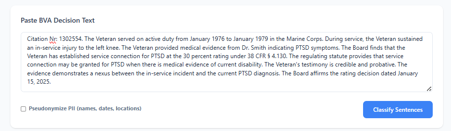
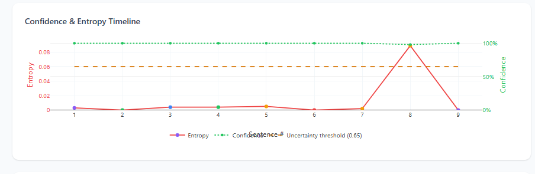
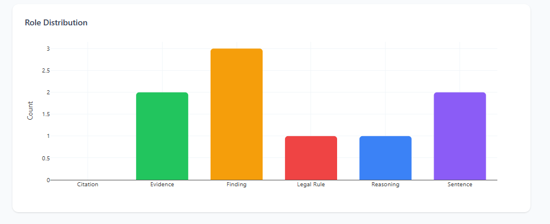
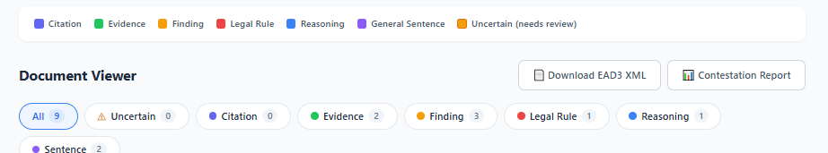
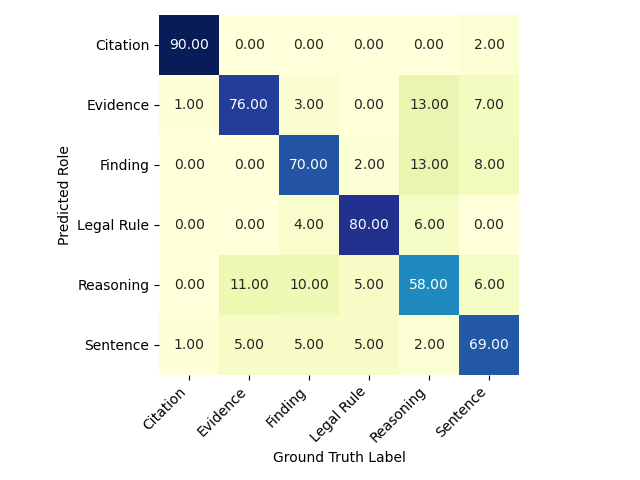
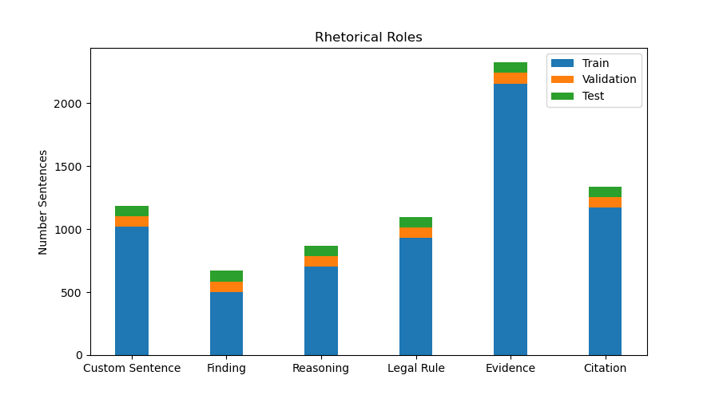

# Archival Rights Role Classifier

**An AI-Augmented Decision-Support System for Archival Processing of Legal Decisions**

*Developed by Baidar Samir*

> Focused on human rights documentation, data protection, and archival theory.

---

## Abstract

This system classifies sentences in U.S. Board of Veterans' Appeals (BVA) decisions into six rhetorical roles: **Citation**, **Evidence**, **Finding of Fact**, **Legal Rule**, **Reasoning**, and **General Sentence**. It uses a bidirectional LSTM neural network with LegalBERT embeddings.

This is a decision-support tool, not a full automation system. Archivists maintain final control over all classifications. Features include:

1. **Uncertainty quantification**: Shannon entropy flags ambiguous predictions (max probability < 0.65) as `UNCERTAIN` for mandatory human review.
2. **PII pseudonymisation**: Named entity recognition detects and replaces personally identifiable information before classification.
3. **Correction audit trail**: Archivists can override any prediction. Every correction is logged with a timestamp to a CSV file for accountability and retraining.
4. **EAD3 finding aid generation**: Classified sentences are automatically structured into valid [Encoded Archival Description (EAD3)](https://www.loc.gov/ead/) XML documents for archival management systems.
5. **Label contestation analysis**: The correction log shows which roles the model most frequently misclassifies, helping target model improvements.
6. **Confidence timeline visualization**: Dual-axis chart shows entropy and confidence across the document to identify uncertain regions.
7. **Word-level attribution**: Gradient-based explainability highlights which words most influenced each prediction, enabling archivists to understand model reasoning.

---

## Theoretical Motivation

The design is guided by three principles from archival science:

| Principle | Implementation |
|-----------|---------------|
| **AI augments archivists, it does not replace them** | Uncertainty flagging and mandatory review for low-confidence predictions. No sentence is committed without human review capability. |
| **Archives construct truth. Archivists must be legally literate** | The system processes real BVA PTSD decisions involving veterans' rights, mental health adjudication, and evidentiary standards. |
| **Data protection is an archival responsibility** | PII pseudonymisation runs before embedding, so personal data never reaches the classification model when enabled. |

---

## Human Rights Implications

This system processes **Board of Veterans' Appeals decisions** for PTSD service-connection claims. Archival accuracy directly affects veterans' access to disability benefits. Classification errors have real consequences:

- **Evidence misclassified as Reasoning**: If factual testimony ("The Veteran reported nightmares daily") is marked as legal reasoning, archivists may miss critical evidence.
  
- **Finding misclassified as Sentence**: Board findings are legally binding. Marking them as general narrative loses their legal weight.

- **Citation errors**: Missing legal citations obscures precedents for veterans' rights.

The **contestation report** identifies model weaknesses for retraining and shows where the model disagrees with archivists most often.

### Corpus Limitations

The VetClaims-JSON dataset contains only **PTSD service-connection claims**, which creates selection bias:
- PTSD claims have unique evidentiary requirements (stressor corroboration, nexus opinions)
- The model has not been tested on physical disability claims, which may have different patterns
- Future work should test performance on granted vs. denied claims. Different performance would mean the model is learning case outcomes instead of rhetorical roles.

### Archival Responsibility

By flagging uncertain classifications and keeping the correction audit trail, this system recognizes that **archives are not neutral**. Every classification is an interpretive choice that affects how researchers access records. Archivists retain final authority because they understand the **social and legal context** of these decisions.

---

## Architecture

```
┌─────────────────────────────────────────────────────────────────────┐
│                         Web Interface (HTML/JS)                     │
│  Text Input → [Pseudonymise?] → Evaluate → Results Dashboard        │
│  Confidence Timeline │ Role Distribution │ Sentence Cards           │
│  Word Attribution (on click) │ Correction Dropdown │ EAD-XML        │
│  Label Contestation Report                                          │
└────────────────────────────────┬────────────────────────────────────┘
                                 │ HTTP (FastAPI)
┌────────────────────────────────▼────────────────────────────────────┐
│                        Backend Pipeline                             │
│                                                                     │
│  1. PII Filter (spaCy NER: en_core_web_lg)                         │
│     └─ PERSON → [VETERAN/PHYSICIAN]                                 │
│     └─ DATE → [DATE]                                                │
│     └─ GPE → [LOCATION]                                             │
│     └─ ORG → [ORGANIZATION]                                         │
│     └─ CARDINAL → [NUMBER]                                          │
│                                                                     │
│  2. Sentence Segmentation (spaCy, custom legal rules)               │
│                                                                     │
│  3. Sentence Encoding                                               │
│     └─ LegalBERT (nlpaueb/legal-bert-base-uncased) → 768-d vectors │
│                                                                     │
│  4. Classification                                                  │
│     └─ Bidirectional LSTM (768→16 hidden→6 classes, Dice Loss)     │
│     └─ Entropy computation: H = −Σ(pᵢ · log pᵢ)                  │
│     └─ Uncertainty flag: max(p) < 0.65 → UNCERTAIN                 │
│                                                                     │
│  5. Word Attribution (on-demand)                                    │
│     └─ Input×gradient through BERT→LSTM pipeline                    │
│     └─ Subword-to-word token merging                                │
│     └─ Normalized saliency scores [0,1]                             │
│                                                                     │
│  6. Finding Aid Generator → EAD3 XML                               │
│  7. Correction Logger → CSV audit trail                             │
│  8. Contestation Analyser → disagreement statistics                 │
└─────────────────────────────────────────────────────────────────────┘
```

---

## Dataset

The system uses the [VetClaims-JSON](https://github.com/LLTLab/VetClaims-JSON) corpus:

- **75 BVA decisions** on PTSD service-connection claims
- **~20,000 annotated sentences** across 6 rhetorical roles
- Train/validation/test split at the **document level** (no sentence leakage)
- Balanced sampling with Dice Loss to handle class imbalance

Reference:

> Walker, V.R., Pillaipakkamnatt, K., Davidson, A.M., Linares, M. & Pesce, D.J. (2019). "Automatic Classification of Rhetorical Roles for Sentences: Comparing Rule-Based Scripts with Machine Learning." *Proceedings of the Third Workshop on Automated Semantic Analysis of Information in Legal Text (ASAIL 2019)*, Montreal, QC, Canada.

---

## Project Structure

```
├── src/
│   ├── webapp.py                    # FastAPI backend (endpoints: /, /doc, /correct, /finding-aid, /contestation)
	├── pii_filter.py                # spaCy NER-based PII detection & pseudonymisation
	├── finding_aid.py               # EAD3 XML finding aid generator
│   ├── segmentation_pipeline.py     # Custom legal sentence boundary detection
│   ├── segmenter.py                 # spaCy segmenter with legal-domain rules
│   ├── sentence_encoder.py          # LegalBERT sentence embedding
│   ├── dataset_preparation.py       # Corpus preprocessing
│   ├── dataset_analyze.py           # Exploratory data analysis
│   └── classification/
│       ├── prediction.py            # Inference with entropy & uncertainty
│       ├── nn_models.py             # LSTM_Net architecture definition
│       ├── custom_pytorch_dataset.py
│       ├── train.py                 # Training loop with Dice Loss
│       └── dice_loss.py             # Dice coefficient loss function
├── web_app_templates/
│   └── index.html                   # UI: classification table, EAD download, contestation
├── data/
│   ├── model_weights/               # Pre-trained LSTM weights (.dat)
│   ├── BVA Decisions JSON Format/   # 50 original BVA decisions
│   ├── BVA Decisions JSON Format +25/ # 25 additional decisions
	├── correction_log.csv           # Archivist correction audit trail
│   └── *.p                          # Pickled DataFrames (embeddings, labels)
├── pyproject.toml                   # Python dependency specification
└── README.md
```

---

## Installation & Setup

### Prerequisites

- **Python** ≥ 3.10 (tested on 3.12)
- **pip** (package manager)

### Steps

```bash
# 1. Clone the repository
git clone <repository-url>
cd Legal-Sentence-Role-Classification-main

# 2. Create and activate virtual environment
python -m venv venv
# Windows:
venv\Scripts\activate
# Linux/macOS:
source venv/bin/activate

# 3. Install dependencies
pip install fastapi uvicorn sentence-transformers transformers spacy torch pandas numpy jinja2 pydantic tqdm

# 4. Download spaCy language models
python -m spacy download en_core_web_lg

# 5. Start the web application
uvicorn src.webapp:app --reload
```

The application is accessible at **http://127.0.0.1:8000**.

On first run, LegalBERT (~440 MB) is downloaded from HuggingFace Hub and cached permanently at `~/.cache/huggingface/`.

### Optional (for training)

```bash
pip install scikit-learn seaborn matplotlib
```

---

## Usage Guide

### 1. Sentence Classification

1. Open **http://127.0.0.1:8000** in a browser.
2. Paste the full text of a BVA decision into the text area.
3. Optionally check **"Pseudonymise sensitive entities"** to replace names, dates, locations, and organisations with role-based placeholders before processing.
4. Click **Perform Evaluation**.
5. The results table displays each sentence with its predicted role, confidence probability, and Shannon entropy.

### 2. Uncertainty Review

- Sentences where max(probability) < 0.65 are highlighted in **amber** and labelled `⚠ UNCERTAIN`.
- Use the **⚠ Uncertain** radio filter to isolate only these sentences for focused archivist review.
- The "Suggested" role is shown inline; the archivist selects the correct role from the dropdown.

### 3. Archivist Corrections

- For any sentence, select the correct role from the dropdown and click **✓**.
- Each correction is appended to `data/correction_log.csv` with a UTC timestamp.
- This audit trail serves dual purposes: accountability evidence and future model retraining data.

### 4. Finding Aid Download (EAD3 XML)

- After classification, click **📄 Download Finding Aid (EAD-XML)**.
- The system generates a valid EAD3 document conforming to the [Library of Congress EAD3 schema](https://www.loc.gov/ead/ead3.xsd).
- Sentences are grouped by rhetorical role into `<c>` components within `<dsc>`.
- Uncertain sentences are marked in a dedicated "Uncertain Classifications (Requires Review)" section.
- The XML includes provenance metadata: generation timestamp, model identity, and uncertainty statistics.

### 5. Label Contestation Report

- Click **📊 Label Contestation Report** to view disagreement statistics.
- The report displays:
  - Total number of archivist corrections
  - Most contested role (most frequently overridden by the archivist)
  - Per-role correction counts
  - Confusion pairs table (predicted → corrected, colour-coded)

---

## Web Interface Features

The system provides a modern, intuitive web interface with advanced explainability features:

### Interface Overview




### Analytics Dashboard

**Statistics Bar** — Real-time metrics summarizing document analysis:


- Total sentence count
- Uncertain predictions requiring review
- Average confidence across all predictions
- Average Shannon entropy
- Dominant rhetorical role in the document

**Confidence & Entropy Timeline** — Visualize model certainty throughout the document:



- **Red line (left axis)**: Shannon entropy per sentence (higher = more uncertain)
- **Green dotted line (right axis)**: Confidence percentage per sentence
- **Orange dashed line**: Uncertainty threshold (0.65) — sentences above this entropy require human review
- Helps identify sections of the document where the model struggles

**Role Distribution Chart** — Breakdown of rhetorical roles:



Shows the count of each rhetorical role type in the classified document, color-coded by role.

### Interactive Document Viewer

**Filter Pills** — Filter sentences by role or uncertainty status:



Click any role pill to show only sentences of that type. The "Uncertain" filter isolates predictions needing review.

**Sentence Cards** — Color-coded cards with expandable details:


Each sentence card displays:
- Sentence number and text
- Color-coded left border indicating predicted role
- Role badge with confidence percentage
- Entropy value with percentage of maximum uncertainty
- Yellow border + ⚠ icon for uncertain predictions

### Explainability Features

**Word-Level Attribution Highlighting** — Click any sentence to reveal which words most influenced the model's prediction:

- Gradient-colored word highlighting (low to high influence)
- Hover tooltips showing exact influence percentage per word
- Visual gradient legend bar
- Lazy-loaded on demand to minimize computational overhead
- Uses **input×gradient** attribution through the full BERT→LSTM pipeline

**Correction Interface** — Dropdown to reassign incorrect predictions with audit trail logging.

---

## API Endpoints

| Method | Endpoint | Description |
|--------|----------|-------------|
| `GET` | `/` | Web interface |
| `POST` | `/doc` | Classify sentences. Body: `{"text": "...", "pseudonymize": false}` |
| `POST` | `/correct` | Log archivist correction. Body: `{"sentence": "...", "predicted_role": "...", "corrected_role": "..."}` |
| `POST` | `/finding-aid` | Generate EAD3 XML. Body: `{"sentences": [...], "title": "...", "decision_date": "..."}` |
| `GET` | `/contestation` | Return label contestation statistics as JSON |
| `POST` | `/attribution` | Compute word-level attribution. Body: `{"sentence": "..."}` Returns word influence scores |

---

## Model Performance

The bidirectional LSTM with LegalBERT embeddings, trained with Dice Loss on the balanced VetClaims dataset, achieves results consistent with Walker et al. (2019):



---

## Key Design Decisions

| Decision | Rationale |
|----------|-----------|
| **Threshold 0.65 for uncertainty** | Balances false-positive uncertain flags against missed ambiguities; tunable per deployment |
| **Shannon entropy (not just max-prob)** | Entropy captures distribution shape. A flat 6-way distribution (H ≈ 1.79) is different from a peaked bimodal one, even at the same max-prob. |
| **PII filter before encoding** | Ensures personal data never reaches the embedding model, implementing *privacy by design* |
| **EAD3 (not EAD 2002)** | EAD3 is the current standard maintained by SAA/LoC since 2015 |
| **CSV correction log (not database)** | Simple, portable, transparent. Archivists can inspect/edit/export the log directly. |
| **Dice Loss (not Cross-Entropy)** | Handles severe class imbalance (Sentence class dominates) without explicit class weighting |
| **Input×gradient attribution** | Efficient gradient-based word attribution through BERT→LSTM pipeline without requiring SHAP or LIME |
| **Dual-axis timeline chart** | Shows both entropy (uncertainty) and confidence on same plot to reveal model behavior patterns |

---

## Technical Implementation: Explainability Features

### Word-Level Attribution

The word attribution system traces how individual words influence the final classification decision through the complete model pipeline:

**Pipeline**: BERT tokenization → token embeddings → mean pooling → LSTM → softmax

**Attribution Method**: Input×gradient saliency
1. Tokenize sentence with LegalBERT tokenizer (`nlpaueb/legal-bert-base-uncased`)
2. Forward pass through BERT to get token embeddings (768-d vectors per token)
3. Apply mean pooling across tokens to create sentence embedding
4. Pass through bidirectional LSTM (768→16 hidden units)
5. Compute logits and softmax for 6 classes
6. Backpropagate from predicted class logit to BERT token embeddings
7. Multiply embedding gradients by original embeddings (input×gradient)
8. Take L2 norm across embedding dimensions to get per-token saliency
9. Merge BERT subword tokens back to words using token offsets
10. Normalize scores to [0,1] range for visualization

**Frontend**: Words are highlighted with gradient opacity (low to high influence) with hover tooltips. Attribution is computed lazily (only when a sentence is clicked) to minimize server load.

**Backend endpoint**: `POST /attribution` accepts a sentence string and returns `{words: [...], scores: [...]}`.

### Confidence Timeline Chart

The timeline chart visualizes model confidence across the document using Plotly.js:

- **X-axis**: Sentence index (1, 2, 3, ...)
- **Left Y-axis**: Shannon entropy (red line, 0 to ~0.09 typical range)
- **Right Y-axis**: Confidence percentage (green dotted line, 0% to 100%)
- **Uncertainty threshold**: Orange dashed line at H=0.65 cutoff

This dual-axis visualization helps archivists quickly identify:
- Uncertain regions of the document (entropy peaks)
- Confidence dips that might indicate edge cases
- Document sections requiring focused human review

**Implementation**: Entropy and confidence are computed during classification (no additional API call needed). The chart is rendered client-side after classification completes.

---

## Relevance to Archival Science

This project demonstrates practical skills for modern archival work:

- **Digital preservation**: Generates standards-compliant finding aids (EAD3) from unstructured legal text
- **Appraisal under uncertainty**: Entropy flagging recognizes that classification requires interpretation, not just automation
- **Explainable AI for archival decision-making**: Word-level attribution and confidence visualization help archivists verify model reasoning and identify potential misclassifications
- **Data protection**: PII pseudonymisation follows GDPR principles of data minimization
- **Accountability**: The correction audit trail documents archival decision-making
- **Human rights documentation**: Works with veterans' rights claims where archival accuracy affects access to benefits

---

## Acknowledgements

- **Dataset**: [VetClaims-JSON](https://github.com/LLTLab/VetClaims-JSON) by the LLT Lab, Hofstra Law
- **LegalBERT**: [nlpaueb/legal-bert-base-uncased](https://huggingface.co/nlpaueb/legal-bert-base-uncased) by the NLP Group, Athens University of Economics and Business
- **EAD3 Standard**: Society of American Archivists & Library of Congress

---

## License

This project is for educational and research purposes.
---
# Dataset Description



## Documents Dataframe:
- docId: Document ID
- dataset_type: Usable for Segmentation and/or classification (0 is both, 1 is only classification)
- text: Full Text of BVA decision
  
## Sentence Dataframe:
- sentID: Consists of Document ID +Paragraph Number + Sentence Number within Paragraph
- docID: Document ID
- dataset_type:  Usable for Segmentation and/or classification (0 is both, 1 is only classification)
- Split: Train/Val/Test on document level
- 
```          
# 8 documents dataset Type 1 + 3 documents dataset Type 0
test_documents =        ['1400029','1431031','1316146',
                        '1456911','1525217','1554165',
                        '1607479','1710389','18161103',
                        '19139412','19154420']
# 7 documents dataset Type 1 + 3 documents dataset Type 0
validation_documents =  ['1705557','1713615','1315144',
                        '1340434','1715225','1719263',
                        '1731026','19160065','19161706',
                        '18139471']# 7 documents dataset Type 1 + 3 documents dataset Type 0
   ```
- label: Rhetorical Rhole of Sentence (...)
- label_encoded: encoding of label
```label_encoding={'CitationSentence': 0, 'EvidenceSentence': 1, 'FindingSentence': 2, 'LegalRuleSentence': 3, 'ReasoningSentence': 4, 'Sentence': 5}```
- text: Full text of the sentence